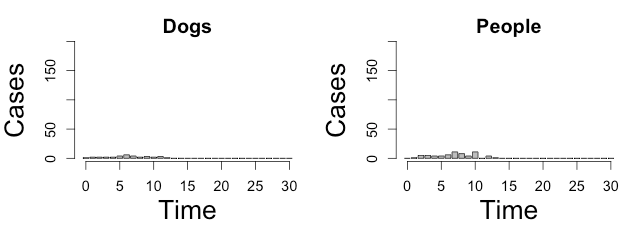
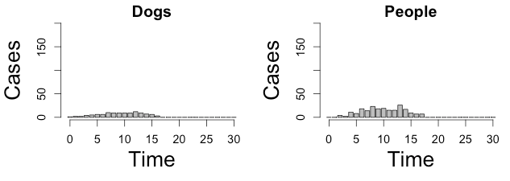

# Part 2: Introduction of a veterinary vaccine

A veterinary vaccine against DF had been approved for use in dogs in mid-2010, but since there was not a problem that year, the Health Department did not promote it. Following the resurgence of DF in 2011, however, information on the vaccine was sent to veterinarians and pet owners in an effort to encourage vaccine uptake. By the beginning of 2012, 40 percent of the dog population in Daidd County had been vaccinated.

In 2012, the number of DF cases was substantially lower than in any year other than 2010, with only 34 cases in dogs and 64 human cases, occurring over a period of 13 weeks:

### 2012

Based on this information, opinion among Health Department employees was divided on the success of the vaccine. Some employees argued that the vaccine had effectively reduced the number of DF cases, and that the reduction in canine cases due to the vaccine might have indirectly protected people from contracting the disease as well. Other employees pointed out that there were more cases in 2012 than in 2010 (before the vaccine had been approved), and argued that vaccination of only 40 percent of dogs could not explain a 20-fold reduction in the number of canine cases (from an average of ~780 cases in previous years with outbreaks). This group concluded that the relatively small number of cases in 2012 could be unrelated to adoption of the vaccine.

Not liking to rock the boat, the Health Department's Director ultimately decided to continue the vaccine information campaign for another year and then reassess the situation. Veterinarians and pet owners were encouraged to vaccinate dogs and reminded that the vaccine needs to be renewed annually. The community's response to the vaccine was generally positive, with anecdotal evidence suggesting no vaccinated dogs had gotten sick in 2012, and by the beginning of 2013, 50 percent of the dog population in Daidd County had been vaccinated.

As it turned out, the 2013 data did not clarify things for the Director, and the debate within the department only grew more heated, with each side claiming that the 2013 data supported their argument:

### 2013

In the first 17 weeks of 2013, 109 dogs and 213 people contracted DF.

What arguments might the groups on each side of the debate make about these data? What additional information (other than more years of data) would be useful to help determine to what extent the vaccine is responsible for the differences in the outbreaks observed before and after its introduction?
